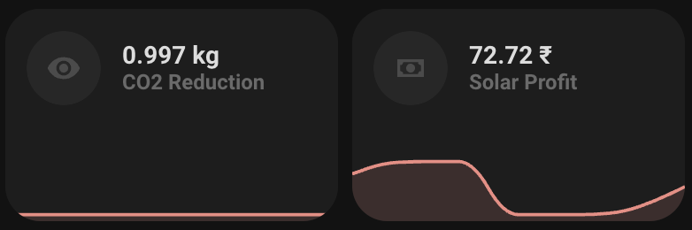

# Shine Monitor

Shine Monitor integration for Home Assistant. This integration allows you to monitor your solar power production and environmental impact using Shine Monitor.

## Features

- Current Solar Power
- Total Solar Production
- Solar Profit
- Coal Saving
- CO2 Reduction
- SO2 Reduction

## Installation

### Manual Installation

1. Download the `shine_monitor` folder from this repository.
2. Copy the `shine_monitor` folder to your Home Assistant's `custom_components` directory.
3. Restart Home Assistant.

### HACS Installation

1. Ensure that [HACS](https://hacs.xyz/) is installed.
2. Go to HACS > Integrations.
3. Click on the three dots in the top right corner and select "Custom repositories".
4. Add the repository URL: `https://github.com/pranjaljain0/shine_monitor` and select the category as "Integration".
5. Click "Add".
6. Find and install the "Shine Monitor" integration.
7. Restart Home Assistant.

## Configuration

1. Go to Configuration > Integrations.
2. Click on "Add Integration" and search for "Shine Monitor".
3. Follow the setup instructions to authenticate and select your plant.

## Required Fields

Before getting the data, you need to fill in the following fields:

- `username`: Your Shine Monitor username.
- `password`: Your Shine Monitor password.
- `company_id`: Your company ID.

### How to Get the Company ID

1. Open your web browser and log in to your Shine Monitor account.
2. Open the developer tools (usually by pressing `F12` or `Ctrl+Shift+I`).
3. Go to the "Network" tab.
4. Log in to your Shine Monitor account.
5. Look for the authentication request sent to `*.shinemonitor.com`.
6. The `company_id` will be included in the authentication request.

## Screenshots

## Support

For any issues or feature requests, please open an issue on the [GitHub repository](https://github.com/pranjaljain0/shine_monitor/issues).

## License

This project is licensed under the MIT License.
